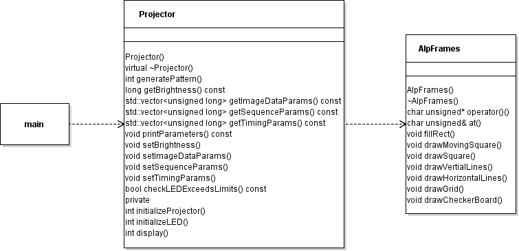

# ALP Projector
This is a project for LSP, wherein we are to R&D an interface for a projector, and further down the line a camera as well.

The project with pre-existing code has been given to us, containing sample code modified to work with the projector. Our goal is to refactor the projector code into a class and improve it, from which you can easily interface with ours or any projector from the same brand of projectors.

## Goals
### Refactor
- [x] Move everything to a Projector class
- [x] Generalize the methods to allow for intercompatibility
- [x] Make hardcoded variables into member variables with get/set methods
- [x] Finding an alternative to memset, for programming patterns
- [x] Add good comments / fix the ones that arent
- [x] Get familiar with the drawing class (AlpFrames) and the use of memset
- [x] Refactor AlpFrames class (Rename everything, remove inheritance, move drawing out of constructor, remove nonsense _ASSERTs)
### Improve
- [x] Add projector patterns that seem useful (i.e. Vertical lines, checkerboard, grids, etc.)
- [x] Replace _ASSERT statements with proper error handling
- [ ] Add OpenCV integration (convert image to grayscale image object, image objects to 1d array for memset)
- [ ] Prepare for front-end integration, i.e. GUI's etc.
- [ ] Remember good comments!

## Install
### Prerequisites
- [Visual Studio 2022 Community](https://visualstudio.microsoft.com/thank-you-downloading-visual-studio/?sku=Community&channel=Release&version=VS2022&source=VSLandingPage&cid=2030&passive=false)
- [Hi-Speed V-Modules](https://www.vialux.de/support/download/ALP42_install.exe)
### Get the Repository
You have a few options to get the repo
1. [Download it](https://github.com/Therkelsen/LSP/archive/refs/heads/main.zip)
2. Clone it
   `$ git clone https://github.com/Therkelsen/LSP`
### Program structure
To edit/run the project, navigate to `*/LSP/ALP_Projector-main/ALP LED API Sample Single-Color/` and open `ALP LED API Sample Single-Color.sln` in Visual Studio.

The main file creates an instance of the Projector object, and calls Projector::generatePattern. If you want to change what is drawn, for now, you'll have to call a different draw function in Projector::generatePattern. 

For illustration, see the class diagram below.

 